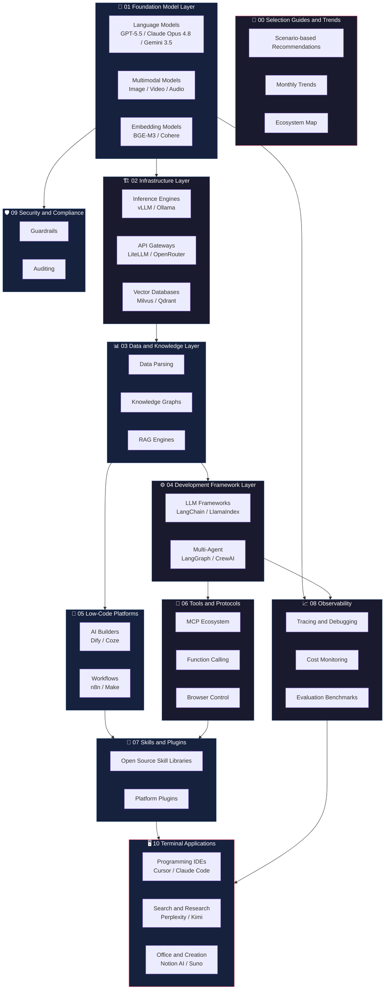
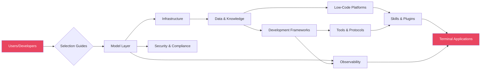
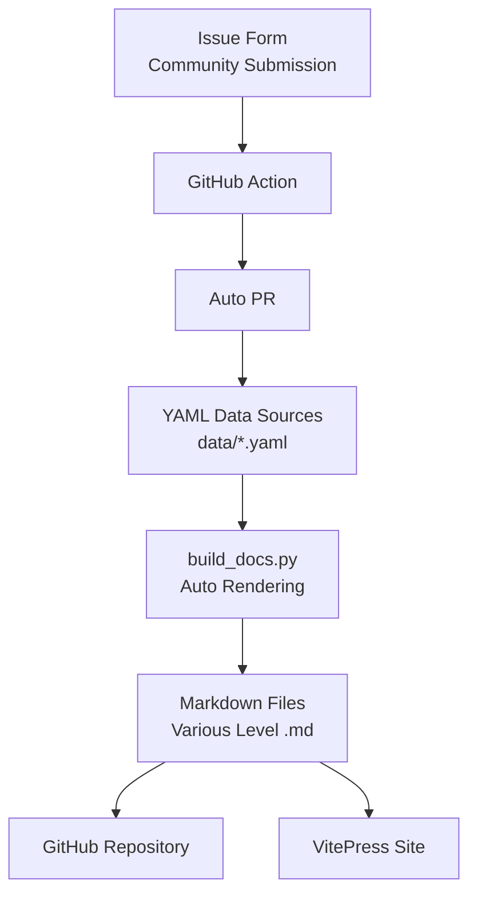

# AI Technology Stack Ecosystem Map

> Last Updated: 2026-06-08

---

## Architecture Layer Diagram

---

## Technology Stack Flow

---

## Core Data Flow

---

## June 2026 AI Landscape Overview

### Model Layer

| Tier | Model | Vendor | Positioning |
| ------ | ------- | -------- | ------------- |
| **T0 Flagship** | [GPT-5.5](https://openai.com) Pro | OpenAI | Strongest Intelligence, Agent/Coding/Knowledge Work |
| **T0 Flagship** | [Claude Opus 4](https://anthropic.com).8 | Anthropic | Strongest Agent Reliability, Coding Consistency |
| **T0 Flagship** | [Gemini 3.5 Flash](https://gemini.google.com) | Google | Agent Workflows, Multi-Agent Coordination |
| **T1 High Cost-Performance** | [DeepSeek-V4-Pro](https://deepseek.com) | DeepSeek | Open-Source MoE, 1M Context |
| **T1 High Cost-Performance** | [Qwen3-Coder](https://qwen.ai)-480B | Alibaba | Agent-level Programming, Open-Source |
| **T1 High Cost-Performance** | [GLM-5.1](https://open.bigmodel.cn) | Zhipu AI | Omnimodal Matrix, Chinese Optimization |
| **T2 Lightweight** | [GPT-5.5-mini](https://openai.com) | OpenAI | High Cost-Performance, Rapid Response |
| **T2 Lightweight** | [Claude Haiku 4](https://anthropic.com) | Anthropic | Lightweight, Low Cost |
| **T2 Lightweight** | [DeepSeek-V4-Flash](https://deepseek.com) | DeepSeek | Ultra-High Cost-Performance |

### Tool Layer

| Category | Representative Tools | Core Capabilities |
| ---------- | ---------------------- | ------------------- |
| **AI IDE** | Cursor, Windsurf | AI-Native Coding, Agent Mode |
| **Coding Agents** | [Codex](https://openai.com), Claude Code | Autonomous Coding in Terminal, PR Generation |
| **AI App Builders** | Bolt.new, Lovable, v0 | Generating Complete Apps with One Prompt |
| **AI Search** | Perplexity, Kimi | Real-Time Search + AI Summarization |
| **Agent Frameworks** | [OpenAI Agents SDK](https://platform.openai.com/docs/assistants/overview), LangGraph | Agent Orchestration, Tool Calling |
| **Tool Protocols** | MCP, A2A | Standardized Tool Connections |

### Trend Layer

1. **Agents as the Core**: All frontier models feature Agent capabilities as their core selling point.
2. **Explosion of Coding Agents**: Codex, Claude Code, and Cursor have comprehensively transitioned to Agentic paradigms.
3. **Computer Use as Standard**: GPT-5.5 OSWorld 78.7%, Claude Opus 4.8 Online-Mind2Web 84%.
4. **Multi-Agent Coordination**: Gemini 3.5 focuses on multi-Agent workflows.
5. **Mainstreaming of Vibe Coding**: Natural language-driven development approaches are widely accepted.
6. **MCP as the De Facto Standard**: Supported by all mainstream IDEs/frameworks.
7. **Continuous Catch-Up by Chinese Models**: DeepSeek V4, GLM-5.1, and Kimi K2-6 have all reached frontier levels.

---

> Data-driven, automated maintenance, community co-creation.
