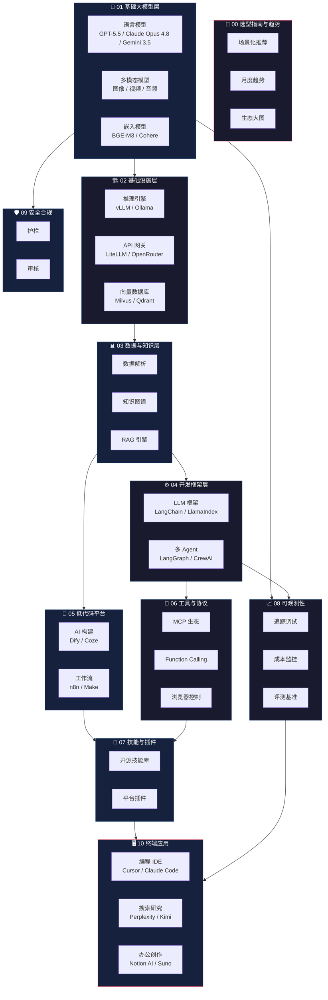
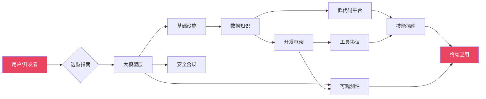
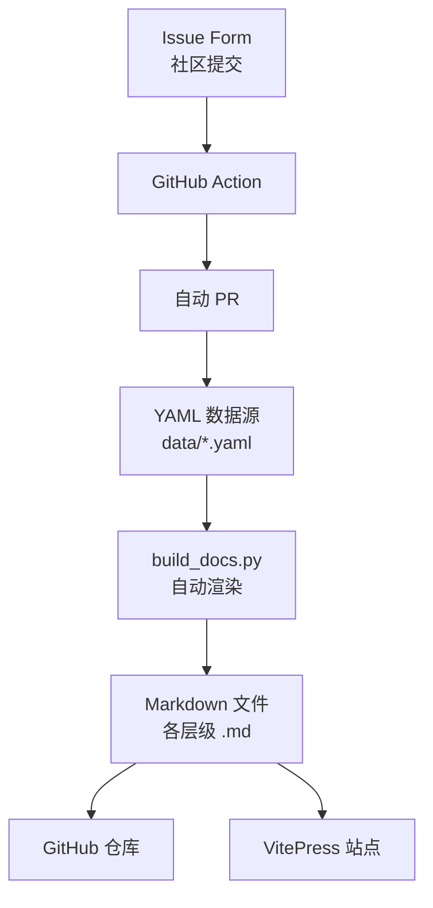

# AI 技术栈生态全景图

> 最后更新：2026-06-08

---

## 架构分层图

---

## 技术栈流向

---

## 核心数据流

---

## 2026年6月 AI 格局概览

### 模型层

| 梯队 | 模型 | 厂商 | 定位 |
| ------ | ------ | ------ | ------ |
| **T0 旗舰** | [GPT-5.5](https://openai.com) Pro | OpenAI | 智能最强，Agent/编码/知识工作 |
| **T0 旗舰** | [Claude Opus 4](https://anthropic.com).8 | Anthropic | Agent 可靠性最强，编码一致性 |
| **T0 旗舰** | [Gemini 3.5 Flash](https://gemini.google.com) | Google | Agent 工作流，多 Agent 协调 |
| **T1 高性价比** | [DeepSeek-V4-Pro](https://deepseek.com) | DeepSeek | 开源 MoE，1M 上下文 |
| **T1 高性价比** | [Qwen3-Coder](https://qwen.ai)-480B | 阿里 | Agent 级编程，开源 |
| **T1 高性价比** | [GLM-5.1](https://open.bigmodel.cn) | 智谱 | 全模态矩阵，中文优化 |
| **T2 轻量级** | [GPT-5.5-mini](https://openai.com) | OpenAI | 高性价比，快速响应 |
| **T2 轻量级** | [Claude Haiku 4](https://anthropic.com) | Anthropic | 轻量级，低成本 |
| **T2 轻量级** | [DeepSeek-V4-Flash](https://deepseek.com) | DeepSeek | 超高性价比 |

### 工具层

| 类别 | 代表工具 | 核心能力 |
| ------ | ---------- | ---------- |
| **AI IDE** | Cursor, Windsurf | AI 原生编码，Agent 模式 |
| **编码 Agent** | [Codex](https://openai.com), Claude Code | 终端内自主编码，PR 生成 |
| **AI App Builder** | Bolt.new, Lovable, v0 | 一句话生成完整应用 |
| **AI 搜索** | Perplexity, Kimi | 实时搜索+AI 总结 |
| **Agent 框架** | [OpenAI Agents SDK](https://platform.openai.com/docs/assistants/overview), LangGraph | Agent 编排，工具调用 |
| **工具协议** | MCP, A2A | 标准化工具连接 |

### 趋势层

1. **Agent 成为核心**：所有前沿模型均以 Agent 能力为核心卖点
2. **编码 Agent 爆发**：Codex、Claude Code、Cursor 全面 Agent 化
3. **计算机使用成为标配**：GPT-5.5 OSWorld 78.7%，Claude Opus 4.8 Online-Mind2Web 84%
4. **多 Agent 协调**：Gemini 3.5 专注多 Agent 工作流
5. **Vibe Coding 主流化**：自然语言驱动的开发方式被广泛接受
6. **MCP 成为事实标准**：所有主流 IDE/框架均已支持
7. **中国模型持续追赶**：DeepSeek V4、GLM-5.1、Kimi K2-6 均达到前沿水平

---

> 数据驱动，自动化维护，社区共建。
