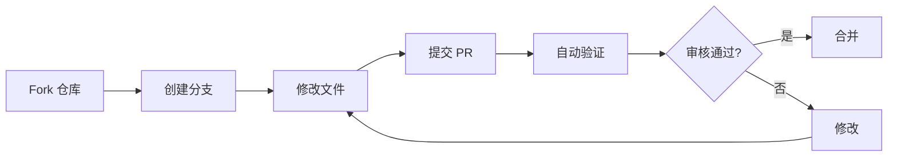

<div align="center">

# 🤝 贡献指南

### **欢迎加入 AI Tech Stack Landscape 社区！**

<br>


<br>

---

</div>

## 📋 目录

- [如何贡献](#如何贡献)
- [提交新工具](#提交新工具)
- [内容格式规范](#内容格式规范)
- [分类规范](#分类规范)
- [PR 流程](#pr-流程)
- [Review 标准](#review-标准)
- [常见问题](#常见问题)

---

## 🎯 如何贡献

<div align="center">

| 方式 | 适合场景 | 难度 |
| :----: | ---------- | :----: |
| 🐛 **报告问题** | 发现错误、过时信息 | ⭐ |
| 💡 **提交工具** | 发现新工具、新产品 | ⭐⭐ |
| 📝 **改进文档** | 优化描述、补充信息 | ⭐⭐ |
| 🔧 **修复代码** | 改进脚本、修复 Bug | ⭐⭐⭐ |
| 🌟 **新功能** | 添加新分类、新特性 | ⭐⭐⭐⭐ |

</div>

---

## 📦 提交新工具

### 方式一：通过 Issue 提交（推荐）

1. 点击 [提交新工具](https://github.com/LuckyOneTwoThree/ai-landscape/issues/new?template=tool-submission.yml)
2. 填写工具信息
3. 等待审核（通常 1-3 天）

### 方式二：通过 PR 提交

1. Fork 本仓库
2. 编辑 `data/` 目录下的 YAML 文件
3. 提交 PR

---

## 📝 内容格式规范

### YAML 文件格式

```yaml
- name: 工具名称
  url: https://github.com/xxx/xxx
  description: 一句话描述
  category: 分类路径
  sub_category: 子分类
  type: open/closed/protocol
  status: active/beta/archived/deprecated
  stars: 10000  # 开源项目必填
  license: MIT  # 开源项目必填
  tags:
    - tag1
    - tag2
  highlights:
    - 亮点1
    - 亮点2
    - 亮点3
```

### 字段说明

| 字段 | 必填 | 说明 |
| ------ | :----: | ------ |
| `name` | ✅ | 工具/产品名称 |
| `url` | ✅ | 官网或 GitHub 仓库链接 |
| `description` | ✅ | 一句话描述（≤100字） |
| `category` | ✅ | 分类路径（见下方） |
| `type` | ✅ | `open`/`closed`/`protocol` |
| `status` | ✅ | `active`/`beta`/`archived`/`deprecated` |
| `stars` | ⚠️ | GitHub Stars（开源项目必填） |
| `license` | ⚠️ | 开源协议（开源项目必填） |
| `tags` | ✅ | 标签列表（从 taxonomy.yaml 选择） |
| `highlights` | ✅ | 3-5 个核心亮点 |

---

## 🏷️ 分类规范

### 主分类

| 分类 | 说明 | 示例 |
| ------ | ------ | ------ |
| `foundation-models` | 基础大模型 | GPT-5, Claude 4, Gemini 3 |
| `infrastructure` | 基础设施 | [vLLM](https://github.com/vllm-project/vllm), [Ollama](https://ollama.com), Milvus |
| `data-and-knowledge` | 数据与知识 | [Unstructured](https://unstructured.io/), LlamaIndex |
| `dev-frameworks` | 开发框架 | LangChain, CrewAI |
| `lowcode-platforms` | 低代码平台 | Dify, Coze, [n8n](https://n8n.io) |
| `tools-and-protocols` | 工具与协议 | MCP, A2A, Function Calling |
| `skills-and-plugins` | 技能与插件 | Agent Skills, MCP Servers |
| `observability` | 可观测性 | Langfuse, LangSmith |
| `safety-and-compliance` | 安全合规 | NeMo Guardrails |
| `applications` | 终端应用 | Cursor, Perplexity |

### 子分类

每个主分类下有多个子分类，详见各分类的 YAML 文件。

---

## 🔄 PR 流程

<div align="center">



</div>

### 步骤详解

1. **Fork 仓库** - 点击右上角 Fork 按钮
2. **创建分支** - `git checkout -b add-xxx-tool`
3. **修改文件** - 编辑 `data/` 目录下的 YAML 文件
4. **提交 PR** - 填写 PR 描述，说明添加的工具
5. **等待审核** - 通常 1-3 天

---

## ✅ Review 标准

### 必须满足

- ✅ 所有必填字段完整
- ✅ URL 格式正确且可访问
- ✅ 标签来自 taxonomy.yaml
- ✅ 分类正确
- ✅ 开源项目有 stars 和 license

### 加分项

- ⭐ 提供多个亮点
- ⭐ 使用准确的标签
- ⭐ 提供详细的描述

### 常见拒绝原因

- ❌ 必填字段缺失
- ❌ URL 无法访问
- ❌ 分类错误
- ❌ 重复提交
- ❌ 不符合项目定位

---

## ❓ 常见问题

### Q: 如何选择分类？

A: 参考上方的 [分类规范](#分类规范)，选择最匹配的分类。

### Q: 标签从哪里来？

A: 从 `data/taxonomy.yaml` 文件中选择，共 83 个有效标签。

### Q: 开源项目必须有 GitHub 仓库吗？

A: 是的，开源项目需要 GitHub 仓库链接和 Stars 数量。

### Q: 商业产品可以提交吗？

A: 可以，但需要设置 `type: closed`，并确保产品已公开可用。

### Q: 提交后多久会审核？

A: 通常 1-3 天，复杂情况可能需要更长时间。

---

## 📞 联系我们

<div align="center">

**有问题？**

[](https://github.com/LuckyOneTwoThree/ai-landscape/issues)
[](https://github.com/LuckyOneTwoThree/ai-landscape/discussions)

</div>

---

<div align="center">

**感谢你的贡献！**

**每一份贡献都让这个项目变得更好**

</div>
