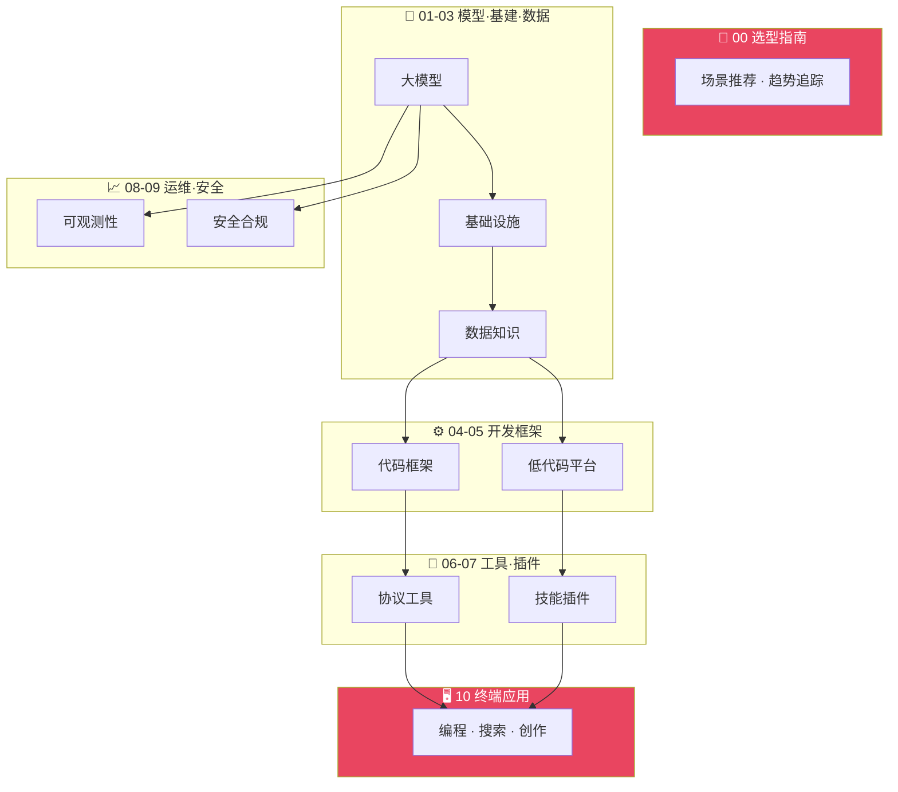

<


<br>

**一份全面、结构化的 AI 技术栈目录**

**涵盖从基础大模型到终端应用的完整生态**

**帮助开发者、产品经理和决策者快速了解 AI 领域的技术选型与全景格局**

<br>

[](./README.md)
[](./README_CN.md)

<br>

---

</div>

## 📊 项目概览

<div align="center">

| 🎯 **目标** | 📦 **规模** | 🔧 **维护** | 🤝 **社区** |
|:-----------:|:-----------:|:-----------:|:-----------:|
| AI 全栈选型 | 463+ 工具 | 自动化构建 | 开源共建 |
| 10 个分类 | 34 篇文档 | YAML 数据源 | Issue 模板 |
| 开发者友好 | 持续更新 | CI/CD | PR 欢迎 |

</div>

---

## 🏗️ 架构全景

<div align="center">



</div>

---

## 📑 快速导航

<div align="center">

| 层级 | 目录 | 核心内容 | 工具数 |
|:----:|------|----------|:------:|
| `00` | [选型指南与趋势](./00-guides-and-trends/) | 行业趋势分析、技术选型建议与横向对比 | 3 |
| `01` | [基础大模型层](./01-foundation-models/) | LLM、多模态模型、开源与闭源模型汇总 | 58 |
| `02` | [基础设施层](./02-infrastructure/) | GPU 云、推理引擎、训练平台、MLOps | 52 |
| `03` | [数据与知识层](./03-data-and-knowledge/) | 数据管线、向量数据库、知识图谱、RAG | 32 |
| `04` | [代码开发框架层](./04-dev-frameworks/) | LangChain、LlamaIndex、Semantic Kernel 等 | 29 |
| `05` | [低代码平台](./05-lowcode-platforms/) | Dify、Coze、Flowise 等低代码/无代码平台 | 17 |
| `06` | [底层工具与协议](./06-tools-and-protocols/) | MCP、A2A、Function Calling、Tool Use | 62 |
| `07` | [技能与插件](./07-skills-and-plugins/) | Agent 技能、插件市场、能力扩展模块 | 98 |
| `08` | [可观测性与运维](./08-observability/) | LLM 监控、Tracing、评估、日志与告警 | 17 |
| `09` | [安全与合规](./09-safety-and-compliance/) | 内容审核、数据隐私、AI 安全防护、合规框架 | 12 |
| `10` | [终端成品应用](./10-applications/) | AI 助手、编程工具、搜索、创意等终端产品 | 86 |

</div>

---

## 🧭 我应该从哪里开始？

<div align="center">

| 角色 | 推荐入口 | 原因 |
|:----:|----------|------|
| 👨‍💻 **开发者** | [`04-dev-frameworks`](./04-dev-frameworks/) → [`06-tools-and-protocols`](./06-tools-and-protocols/) | 快速找到构建 AI 应用所需的框架和协议 |
| 📋 **产品经理** | [`05-lowcode-platforms`](./05-lowcode-platforms/) → [`07-skills-and-plugins`](./07-skills-and-plugins/) | 了解可落地的低代码方案和已有插件能力 |
| 🙋 **终端用户** | [`10-applications`](./10-applications/) | 直接浏览已上线的 AI 产品和工具 |
| 🧑‍💼 **决策者** | [`00-guides-and-trends`](./00-guides-and-trends/) | 行业全景、趋势判断和选型参考 |

</div>

---

## 🔥 2026年6月 AI 格局

<div align="center">

### 🏆 前沿模型梯队

</div>

| 梯队 | 模型 | 厂商 | 定位 |
|:----:|------|------|------|
| **T0 旗舰** | GPT-5.5 Pro | OpenAI | 智能最强，Agent/编码/知识工作 |
| **T0 旗舰** | Claude Opus 4.8 | Anthropic | Agent 可靠性最强，编码一致性 |
| **T0 旗舰** | Gemini 3.5 Flash | Google | Agent 工作流，多 Agent 协调 |
| **T1 高性价比** | DeepSeek-V4-Pro | DeepSeek | 开源 MoE，1M 上下文 |
| **T1 高性价比** | Qwen3-Coder-480B | 阿里 | Agent 级编程，开源 |
| **T2 轻量级** | GPT-5.5-mini | OpenAI | 高性价比，快速响应 |

<div align="center">

### 🚀 核心趋势

</div>

1. **Agent 成为核心** - 所有前沿模型均以 Agent 能力为核心卖点
2. **编码 Agent 爆发** - Codex、Claude Code、Cursor 全面 Agent 化
3. **计算机使用成为标配** - GPT-5.5 OSWorld 78.7%，Claude Opus 4.8 Online-Mind2Web 84%
4. **多 Agent 协调** - Gemini 3.5 专注多 Agent 工作流
5. **Vibe Coding 主流化** - 自然语言驱动的开发方式被广泛接受
6. **MCP 成为事实标准** - 所有主流 IDE/框架均已支持

---

## 🚀 快速开始

<div align="center">

### 本地运行

</div>

```bash
# 克隆仓库
git clone https://github.com/LuckyOneTwoThree/ai-landscape.git
cd ai-landscape

# 安装依赖
pip install pyyaml

# 验证数据
python scripts/validate.py

# 构建文档
python scripts/build_docs.py

# 查看生成的文档
open docs/index.html
```

<div align="center">

### 贡献新工具

</div>

1. **Fork** 本仓库
2. **编辑** `data/` 目录下的 YAML 文件
3. **提交** PR，我们会尽快审核

或者直接 [提交 Issue](https://github.com/LuckyOneTwoThree/ai-landscape/issues/new?template=tool-submission.yml) 告诉我们你发现的工具！

---

## 🤝 贡献指南

<div align="center">

**我们欢迎任何形式的贡献！**

</div>

请先阅读 [CONTRIBUTING.md](./CONTRIBUTING.md) 了解：

- ✅ 如何提交新的工具/产品条目
- ✅ 内容格式与分类规范
- ✅ PR 流程与 Review 标准

> 💡 发现遗漏的工具或错误信息？提个 Issue 或直接开 PR，都是对我们最好的支持！

---

## 📄 License

<div align="center">

本项目采用 [MIT License](./LICENSE) 开源

**自由使用，自由分享，自由修改**

</div>

---

## 🙏 致谢

<div align="center">

感谢所有贡献者和以下开源项目：

[](https://github.com/awesome-selfhosted/awesome-selfhosted)
[](https://github.com/acheong08/awesome-chatgpt-plugins)
[](https://github.com/punkpeye/awesome-mcp-servers)

</div>

---

<div align="center">

**如果这个项目对你有帮助，请给我们一个 ⭐ Star 支持一下！**

**你的支持是我们持续更新的动力**

</div>
]]>