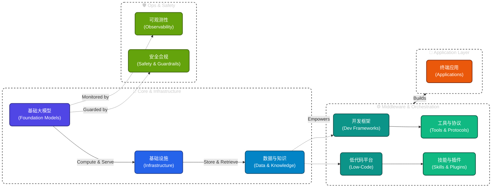

<div align="center">

# 🌐 AI 技术栈全景图

### 结构化收录 AI 全生态工具、模型、框架与平台

从基础大模型到终端应用，一站式掌握 AI 领域技术选型与全景格局。

✨ **全新特性：现已提供交互式 Next.js 站点，支持中英双语 (i18n) 以及动态全局搜索与多维度分类筛选。**

<h3>
  🌟 <a href="https://luckyonetwothree.github.io/ai-landscape/">点击这里访问：交互式 AI 工具探索库 (Interactive Website)</a> 🌟
</h3>

*Works with Claude Code, Cursor, Copilot, Gemini CLI, Hermes Agent, and more.*

<p>
  <a href="https://github.com/LuckyOneTwoThree/ai-landscape/stargazers"></a>
  <a href="https://github.com/LuckyOneTwoThree/ai-landscape/network/members"></a>
</p>

<p>
  
  
  
  
</p>

<p>
  <b>🇺🇸 <a href="./README_EN.md">English</a></b>　|　<b>🇨🇳 中文</b>
</p>

<p>
  <a href="#-模块导航"></a>
  <a href="#-模块导航"></a>
  <a href="#-模块导航"></a>
  <a href="#-模块导航"></a>
  <a href="#-模块导航"></a>
  <a href="#-模块导航"></a>
  <a href="#-模块导航"></a>
  <a href="#-模块导航"></a>
  <a href="#-模块导航"></a>
  <a href="#-模块导航"></a>
</p>

</div>

---

## 📖 目录

- [📊 项目概览](#-项目概览)
- [🏗️ 架构全景](#️-架构全景)
- [📑 模块导航](#-模块导航)
- [🔥 2026年6月 AI 格局](#-2026年6月-ai-格局)
- [🚀 快速开始](#-快速开始)
- [🤝 贡献指南](#-贡献指南)
- [📄 开源协议](#-开源协议)

---

## 📊 项目概览

<table>
  <tr>
    <td align="center"><b>🎯 目标</b></td>
    <td align="center"><b>📦 规模</b></td>
    <td align="center"><b>🔧 维护</b></td>
    <td align="center"><b>🤝 社区</b></td>
  </tr>
  <tr>
    <td align="center">AI 全栈选型</td>
    <td align="center">463+ 工具</td>
    <td align="center">自动化构建</td>
    <td align="center">开源共建</td>
  </tr>
  <tr>
    <td align="center">10 个分类</td>
    <td align="center">34 篇文档</td>
    <td align="center">YAML 数据源</td>
    <td align="center">Issue 模板</td>
  </tr>
</table>

---

## 🏗️ 架构全景

<div align="center">



</div>

---

## 📑 模块导航

| 层级 | 模块 | 说明 | 工具数 |
| :----: | ------ | ------ | :------: |
| `00` | [选型指南与趋势](./00-guides-and-trends/) | 行业趋势、技术选型、横向对比 | 3 |
| `01` | [基础大模型](./01-foundation-models/) | LLM、多模态、开源与闭源模型 | 58 |
| `02` | [基础设施](./02-infrastructure/) | GPU 云、推理引擎、向量数据库 | 52 |
| `03` | [数据与知识](./03-data-and-knowledge/) | 数据管线、知识图谱、RAG | 32 |
| `04` | [开发框架](./04-dev-frameworks/) | LangChain、LlamaIndex、多 Agent | 29 |
| `05` | [低代码平台](./05-lowcode-platforms/) | Dify、Coze、[n8n](https://n8n.io) | 17 |
| `06` | [工具与协议](./06-tools-and-protocols/) | MCP、A2A、Function Calling | 62 |
| `07` | [技能与插件](./07-skills-and-plugins/) | Agent 技能、插件市场 | 98 |
| `08` | [可观测性](./08-observability/) | 监控、Tracing、评测 | 17 |
| `09` | [安全合规](./09-safety-and-compliance/) | 护栏、审核、红队测试 | 12 |
| `10` | [终端应用](./10-applications/) | AI IDE、搜索、办公、创作 | 86 |

---

## 🧭 快速入口

<table>
  <tr>
    <td align="center">👨‍💻 开发者</td>
    <td>→ <a href="./04-dev-frameworks/">开发框架</a> + <a href="./06-tools-and-protocols/">工具协议</a></td>
    <td>找框架和协议</td>
  </tr>
  <tr>
    <td align="center">📋 产品经理</td>
    <td>→ <a href="./05-lowcode-platforms/">低代码平台</a> + <a href="./07-skills-and-plugins/">技能插件</a></td>
    <td>找落地方案</td>
  </tr>
  <tr>
    <td align="center">🙋 终端用户</td>
    <td>→ <a href="./10-applications/">终端应用</a></td>
    <td>找现成产品</td>
  </tr>
  <tr>
    <td align="center">🧑‍💼 决策者</td>
    <td>→ <a href="./00-guides-and-trends/">选型指南</a></td>
    <td>看行业全景</td>
  </tr>
</table>

---

## 🔥 2026年6月 AI 格局

### 前沿模型梯队

| 梯队 | 模型 | 厂商 | 定位 |
| :----: | ------ | ------ | ------ |
| **T0** | [GPT-5.5](https://openai.com) Pro | OpenAI | 智能最强，Agent/编码/知识工作 |
| **T0** | [Claude Opus 4](https://anthropic.com).8 | Anthropic | Agent 可靠性最强 |
| **T0** | [Gemini 3.5 Flash](https://gemini.google.com) | Google | Agent 工作流，多 Agent 协调 |
| **T1** | [DeepSeek-V4-Pro](https://deepseek.com) | DeepSeek | 开源 MoE，1M 上下文 |
| **T1** | [Qwen3-Coder](https://qwen.ai)-480B | 阿里 | Agent 级编程，开源 |
| **T2** | [GPT-5.5-mini](https://openai.com) | OpenAI | 高性价比 |

### 核心趋势

1. **Agent 成为核心** — 所有前沿模型以 Agent 能力为卖点
2. **编码 Agent 爆发** — Codex、Claude Code、Cursor 全面 Agent 化
3. **计算机使用标配** — GPT-5.5 OSWorld 78.7%
4. **MCP 成为标准** — 所有主流 IDE/框架已支持
5. **Vibe Coding 主流化** — 自然语言驱动开发被广泛接受
6. **中国模型追赶** — DeepSeek V4、GLM-5.1、Kimi K2 达前沿水平

---

## 🚀 快速开始

本项目包含底层的 YAML 数据源和上层的交互式 Next.js 站点。

### 运行交互式网站 (推荐)

```bash
# 克隆仓库
git clone https://github.com/LuckyOneTwoThree/ai-landscape.git
cd ai-landscape/website

# 安装依赖
npm install

# 启动本地开发服务器
npm run dev
# 浏览器访问 http://localhost:3000
```

### 数据源管理

```bash
cd ai-landscape
pip install -r requirements.txt # 可选，仅数据校验

# 验证数据结构
python scripts/validate.py

# 构建静态文档
python scripts/build_docs.py
```

**多语言提示：** 所有工具词条现在通过 `description` (中文) 和 `description_en` (英文) 提供原生双语支持。前端会在中英文路由中自动回退渲染！

**贡献新工具：**

1. [提交 Issue](https://github.com/LuckyOneTwoThree/ai-landscape/issues/new?template=tool-submission.yml) — 告诉我们你发现的工具
2. Fork → 编辑 `data/*.yaml` → 提交 PR

---

## 🤝 贡献指南

欢迎任何形式的贡献！请阅读 [CONTRIBUTING.md](./CONTRIBUTING.md) 了解：

- ✅ 如何提交新工具
- ✅ 内容格式规范
- ✅ PR 流程与 Review 标准

> 💡 发现遗漏的工具？[提个 Issue](https://github.com/LuckyOneTwoThree/ai-landscape/issues) 或直接开 PR！

---

## 📄 开源协议

本项目采用 [MIT License](./LICENSE) 开源。

---

## 🙏 致谢

感谢 [awesome-selfhosted](https://github.com/awesome-selfhosted/awesome-selfhosted)、[awesome-chatgpt-plugins](https://github.com/acheong08/awesome-chatgpt-plugins)、[awesome-mcp-servers](https://github.com/punkpeye/awesome-mcp-servers) 等开源项目。

---

<div align="center">

**⭐ 如果这个项目对你有帮助，请点个 Star 支持一下！**

</div>
