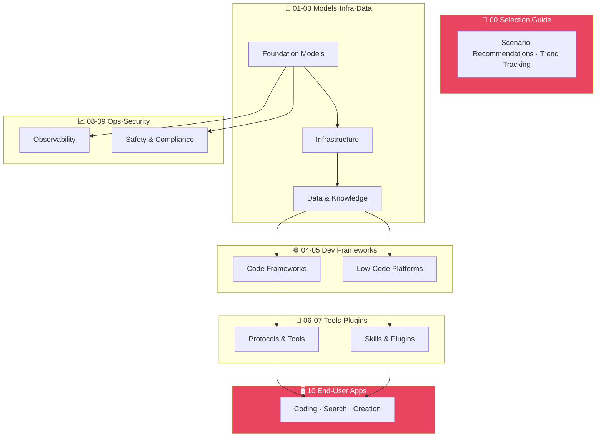

<div align="center">

---

### 🌍 Language / 语言

# [🇺🇸 English](./README.md)　|　[🇨🇳 中文](./README_CN.md)

---

</div>

# 🌐 AI Tech Stack Landscape

### **A Comprehensive Guide to the AI Ecosystem**

<div align="center">


</div>

> **A comprehensive, structured directory of AI tech stacks**
> 
> **Covering the complete ecosystem from foundation models to end-user applications**
> 
> **Helping developers, product managers, and decision-makers quickly understand AI technology choices and landscape**

---

<div align="center">

| 🎯 **Goal** | 📦 **Scale** | 🔧 **Maintenance** | 🤝 **Community** |
|:-----------:|:-----------:|:-----------:|:-----------:|
| AI Stack Selection | 463+ Tools | Auto-build | Open Source |
| 10 Categories | 34 Docs | YAML Data | Issue Templates |
| Developer Friendly | Continuous Updates | CI/CD | PRs Welcome |

</div>

---

## 🏗️ Architecture

<div align="center">



</div>

---

## 📑 Quick Navigation

<div align="center">

| Level | Directory | Core Content | Tools |
|:-----:|-----------|--------------|:-----:|
| `00` | [Selection Guide & Trends](./00-guides-and-trends/) | Industry trends, tech selection advice & comparisons | 3 |
| `01` | [Foundation Models](./01-foundation-models/) | LLM, multimodal models, open & closed source | 58 |
| `02` | [Infrastructure](./02-infrastructure/) | GPU cloud, inference engines, training platforms | 52 |
| `03` | [Data & Knowledge](./03-data-and-knowledge/) | Data pipelines, vector DB, knowledge graphs, RAG | 32 |
| `04` | [Dev Frameworks](./04-dev-frameworks/) | LangChain, LlamaIndex, Semantic Kernel, etc. | 29 |
| `05` | [Low-Code Platforms](./05-lowcode-platforms/) | Dify, Coze, Flowise & other no-code/low-code | 17 |
| `06` | [Tools & Protocols](./06-tools-and-protocols/) | MCP, A2A, Function Calling, Tool Use | 62 |
| `07` | [Skills & Plugins](./07-skills-and-plugins/) | Agent skills, plugin marketplaces, extensions | 98 |
| `08` | [Observability](./08-observability/) | LLM monitoring, tracing, evaluation, logging | 17 |
| `09` | [Safety & Compliance](./09-safety-and-compliance/) | Content moderation, data privacy, AI safety | 12 |
| `10` | [End-User Applications](./10-applications/) | AI assistants, coding tools, search, creative | 86 |

</div>

---

## 🧭 Where Should I Start?

<div align="center">

| Role | Recommended Path | Why |
|:----:|------------------|-----|
| 👨‍💻 **Developer** | [`04-dev-frameworks`](./04-dev-frameworks/) → [`06-tools-and-protocols`](./06-tools-and-protocols/) | Quickly find frameworks and protocols for building AI apps |
| 📋 **Product Manager** | [`05-lowcode-platforms`](./05-lowcode-platforms/) → [`07-skills-and-plugins`](./07-skills-and-plugins/) | Discover low-code solutions and existing plugin capabilities |
| 🙋 **End User** | [`10-applications`](./10-applications/) | Browse AI products and tools ready to use |
| 🧑‍💼 **Decision Maker** | [`00-guides-and-trends`](./00-guides-and-trends/) | Industry landscape, trend analysis, and selection guidance |

</div>

---

## 🔥 AI Landscape - June 2026

<div align="center">

### 🏆 Frontier Model Tiers

</div>

| Tier | Model | Vendor | Focus |
|:----:|-------|--------|-------|
| **T0 Frontier** | GPT-5.5 Pro | OpenAI | Highest intelligence, Agent/Coding/Knowledge work |
| **T0 Frontier** | Claude Opus 4.8 | Anthropic | Best Agent reliability, coding consistency |
| **T0 Frontier** | Gemini 3.5 Flash | Google | Agent workflows, multi-agent coordination |
| **T1 Value** | DeepSeek-V4-Pro | DeepSeek | Open-source MoE, 1M context |
| **T1 Value** | Qwen3-Coder-480B | Alibaba | Agent-level coding, open-source |
| **T2 Lightweight** | GPT-5.5-mini | OpenAI | Cost-effective, fast response |

<div align="center">

### 🚀 Key Trends

</div>

1. **Agents as Core** - All frontier models prioritize Agent capabilities
2. **Coding Agent Explosion** - Codex, Claude Code, Cursor fully Agent-ized
3. **Computer Use Standard** - GPT-5.5 OSWorld 78.7%, Claude Opus 4.8 Online-Mind2Web 84%
4. **Multi-Agent Coordination** - Gemini 3.5 focuses on multi-agent workflows
5. **Vibe Coding Goes Mainstream** - Natural language-driven development widely adopted
6. **MCP Becomes De Facto Standard** - All major IDEs/frameworks support it

---

## 🚀 Quick Start

<div align="center">

### Run Locally

</div>

```bash
# Clone repository
git clone https://github.com/LuckyOneTwoThree/ai-landscape.git
cd ai-landscape

# Install dependencies
pip install pyyaml

# Validate data
python scripts/validate.py

# Build documentation
python scripts/build_docs.py

# View generated docs
open docs/index.html
```

<div align="center">

### Contribute a New Tool

</div>

1. **Fork** this repository
2. **Edit** YAML files in the `data/` directory
3. **Submit** a PR for review

Or simply [open an Issue](https://github.com/LuckyOneTwoThree/ai-landscape/issues/new?template=tool-submission.yml) to tell us about a tool you discovered!

---

## 🤝 Contributing

<div align="center">

**We welcome any form of contribution!**

</div>

Please read [CONTRIBUTING.md](./CONTRIBUTING.md) first to understand:

- ✅ How to submit new tool/product entries
- ✅ Content format and classification standards
- ✅ PR process and review criteria

> 💡 Found a missing tool or incorrect info? Open an Issue or submit a PR - both are great support for us!

---

## 📄 License

<div align="center">

This project is licensed under the [MIT License](./LICENSE)

**Free to use, free to share, free to modify**

</div>

---

## 🙏 Acknowledgments

<div align="center">

Thanks to all contributors and these open-source projects:

[](https://github.com/awesome-selfhosted/awesome-selfhosted)
[](https://github.com/acheong08/awesome-chatgpt-plugins)
[](https://github.com/punkpeye/awesome-mcp-servers)

</div>

---

<div align="center">

**If this project helps you, please give us a ⭐ Star!**

**Your support is our motivation to keep updating**

</div>
