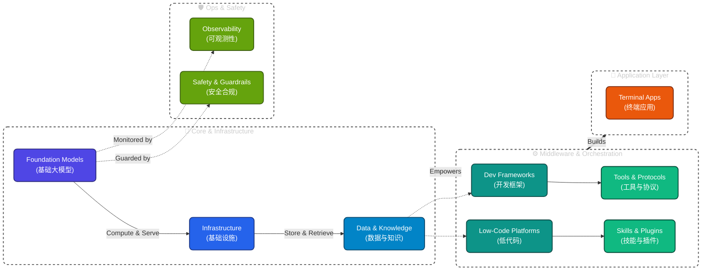

<div align="center">

# 🌐 AI Tech Stack Landscape

### AI 技术栈全景图

<p>
  <a href="https://github.com/LuckyOneTwoThree/ai-landscape/stargazers"></a>
  <a href="https://github.com/LuckyOneTwoThree/ai-landscape/network/members"></a>
</p>

<p>
  
  
  
  
</p>

<p>
  <b>🇺🇸 English</b>　|　<b>🇨🇳 <a href="./README.md">中文</a></b>
</p>

---

A comprehensive, structured AI tech stack directory covering the complete ecosystem from foundation models to end-user applications.

✨ **New Features: Now features an interactive Next.js website with bilingual (i18n) support, global search, and dynamic filtering.**

<h3>
  🌟 <a href="https://luckyonetwothree.github.io/ai-landscape/en">Click Here to Visit: Interactive AI Tools Explorer</a> 🌟
</h3>

Helping developers, product managers, and decision-makers quickly navigate AI technology choices and the full landscape.

</div>

---

## 📖 Table of Contents

- [📊 Overview](#-overview)
- [🏗️ Architecture](#️-architecture)
- [📑 Modules](#-modules)
- [🔥 AI Landscape - June 2026](#-ai-landscape---june-2026)
- [🚀 Quick Start](#-quick-start)
- [🤝 Contributing](#-contributing)
- [📄 License](#-license)

---

## 📊 Overview

<table>
  <tr>
    <td align="center"><b>🎯 Goal</b></td>
    <td align="center"><b>📦 Scale</b></td>
    <td align="center"><b>🔧 Maintenance</b></td>
    <td align="center"><b>🤝 Community</b></td>
  </tr>
  <tr>
    <td align="center">AI Stack Selection</td>
    <td align="center">463+ Tools</td>
    <td align="center">Auto-build</td>
    <td align="center">Open Source</td>
  </tr>
  <tr>
    <td align="center">10 Categories</td>
    <td align="center">34 Docs</td>
    <td align="center">YAML Data</td>
    <td align="center">Issue Templates</td>
  </tr>
</table>

---

## 🏗️ Architecture

<div align="center">



</div>

---

## 📑 Modules

| Level | Module | Description | Tools |
| :-----: | -------- | ------------- | :-----: |
| `00` | [Selection Guide](./00-guides-and-trends/) | Industry trends, tech selection, comparisons | 3 |
| `01` | [Foundation Models](./01-foundation-models/) | LLM, multimodal, open & closed source | 58 |
| `02` | [Infrastructure](./02-infrastructure/) | GPU cloud, inference engines, vector DB | 52 |
| `03` | [Data & Knowledge](./03-data-and-knowledge/) | Data pipelines, knowledge graphs, RAG | 32 |
| `04` | [Dev Frameworks](./04-dev-frameworks/) | LangChain, LlamaIndex, multi-agent | 29 |
| `05` | [Low-Code Platforms](./05-lowcode-platforms/) | Dify, Coze, [n8n](https://n8n.io) | 17 |
| `06` | [Tools & Protocols](./06-tools-and-protocols/) | MCP, A2A, Function Calling | 62 |
| `07` | [Skills & Plugins](./07-skills-and-plugins/) | Agent skills, plugin marketplaces | 98 |
| `08` | [Observability](./08-observability/) | Monitoring, tracing, benchmarks | 17 |
| `09` | [Safety & Compliance](./09-safety-and-compliance/) | Guardrails, moderation, red-teaming | 12 |
| `10` | [End-User Apps](./10-applications/) | AI IDE, search, productivity, creative | 86 |

---

## 🧭 Quick Entry

<table>
  <tr>
    <td align="center">👨‍💻 Developer</td>
    <td>→ <a href="./04-dev-frameworks/">Dev Frameworks</a> + <a href="./06-tools-and-protocols/">Tools & Protocols</a></td>
    <td>Find frameworks and protocols</td>
  </tr>
  <tr>
    <td align="center">📋 Product Manager</td>
    <td>→ <a href="./05-lowcode-platforms/">Low-Code</a> + <a href="./07-skills-and-plugins/">Skills & Plugins</a></td>
    <td>Find deployable solutions</td>
  </tr>
  <tr>
    <td align="center">🙋 End User</td>
    <td>→ <a href="./10-applications/">Applications</a></td>
    <td>Find ready-to-use products</td>
  </tr>
  <tr>
    <td align="center">🧑‍💼 Decision Maker</td>
    <td>→ <a href="./00-guides-and-trends/">Selection Guide</a></td>
    <td>See the full landscape</td>
  </tr>
</table>

---

## 🔥 AI Landscape - June 2026

### Frontier Model Tiers

| Tier | Model | Vendor | Focus |
| :----: | ------- | -------- | ------- |
| **T0** | [GPT-5.5](https://openai.com) Pro | OpenAI | Highest intelligence, Agent/Coding/Knowledge |
| **T0** | [Claude Opus 4](https://anthropic.com).8 | Anthropic | Best Agent reliability |
| **T0** | [Gemini 3.5 Flash](https://gemini.google.com) | Google | Agent workflows, multi-agent |
| **T1** | [DeepSeek-V4-Pro](https://deepseek.com) | DeepSeek | Open-source MoE, 1M context |
| **T1** | [Qwen3-Coder](https://qwen.ai)-480B | Alibaba | Agent-level coding, open-source |
| **T2** | [GPT-5.5-mini](https://openai.com) | OpenAI | Cost-effective |

### Key Trends

1. **Agents as Core** — All frontier models prioritize Agent capabilities
2. **Coding Agent Explosion** — Codex, Claude Code, Cursor fully Agent-ized
3. **Computer Use Standard** — GPT-5.5 OSWorld 78.7%
4. **MCP Becomes Standard** — All major IDEs/frameworks support it
5. **Vibe Coding Mainstream** — Natural language-driven development widely adopted
6. **China Catches Up** — DeepSeek V4, GLM-5.1, Kimi K2 reach frontier level

---

## 🚀 Quick Start

This project includes the underlying YAML data sources and a frontend interactive Next.js website.

### Run the Interactive Website (Recommended)

```bash
# Clone repository
git clone https://github.com/LuckyOneTwoThree/ai-landscape.git
cd ai-landscape/website

# Install dependencies
npm install

# Start local dev server
npm run dev
# Visit http://localhost:3000 in your browser
```

### Data Source Management

```bash
cd ai-landscape
pip install -r requirements.txt # Optional, for data validation only

# Validate data structures
python scripts/validate.py

# Build static documentation
python scripts/build_docs.py
```

**Bilingual Notice:** All tool entries now feature native bilingual support through `description` (Chinese) and `description_en` (English). The frontend automatically handles language fallbacks based on routing!

**Contribute a new tool:**

1. [Open an Issue](https://github.com/LuckyOneTwoThree/ai-landscape/issues/new?template=tool-submission.yml) — Tell us about a tool
2. Fork → Edit `data/*.yaml` → Submit PR

---

## 🤝 Contributing

We welcome any form of contribution! Please read [CONTRIBUTING.md](./CONTRIBUTING.md) to understand:

- ✅ How to submit new tools
- ✅ Content format standards
- ✅ PR process and review criteria

> 💡 Found a missing tool? [Open an Issue](https://github.com/LuckyOneTwoThree/ai-landscape/issues) or submit a PR!

---

## 📄 License

This project is licensed under the [MIT License](./LICENSE).

---

## 🙏 Acknowledgments

Thanks to [awesome-selfhosted](https://github.com/awesome-selfhosted/awesome-selfhosted), [awesome-chatgpt-plugins](https://github.com/acheong08/awesome-chatgpt-plugins), [awesome-mcp-servers](https://github.com/punkpeye/awesome-mcp-servers) and other open-source projects.

---

<div align="center">

**⭐ If this project helps you, please give us a Star!**

</div>
